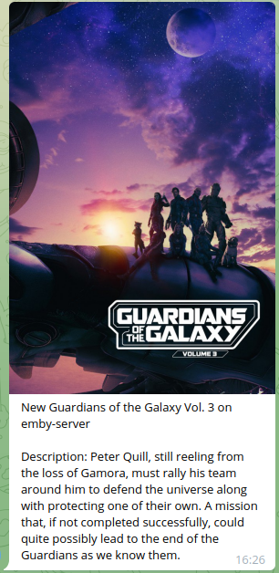

# Emby-Telegram-Notifier
simple webhook server to emby Telegram notification

### Updates
#### version: v0.3
 * Add movies/series Community Rating.
 * For admins: Users add to favorites notification.

### Features
 * Integrates with the webhook plugin.
 * Telegram notifications with media images and summary when a new movie or series is added to Emby.
 * Some pictures:<br>
  

# Installation

## Create a new telegram-bot
**1** - Search Botfather in telegram. <br>
**2** - Send command /newbot to Botfather. <br>
**3** - Give the Telegram bot a name. <br>
**4** - Give the Telegram bot a unique username, it must end in "bot". <br>
**5** - Save the Telegram bot's access token, we will use it later in the configuration file. <br>
**6** - Get your chat ID by starting a chat with your bot, sending a message and then visiting https://api.telegram.org/bot<YOUR_BOT_TOKEN>/getUpdates to find the chat ID in the returned JSON.

## Run the webhook-server
**1** - Create config.yaml file like example in this repo. <br>
&nbsp;&nbsp;&nbsp;**1.1** - You can add admins to get all notification from emby-server.<br>
&nbsp;&nbsp;&nbsp;**1.2** - You can add users to get new/delete items from emby-server.<br>
**(you can add users while the service is still running)**<br>
**2** - Run the server with docker/podman:<br>
docker run:
```
docker run -d --restart=always -v </path/to/config/dir>:/config -p 5000:5000 yoas1/emby-telegram-notifier:v0.3
```
docker compose:
```
version: "3.5"
services:
  emby-webhook:
    container_name: emby-webhook
    image: yoas1/emby-telegram-notifier:v0.3
    volumes:
      - </path/to/config/dir>:/config
    ports:
      - 5000:5000
    restart: always
```
<br>

**3** - Create emby notification:<br>
* Go to Settings --> Notifications
* Add Notifications --> select **Webhook**:
    * Name: name to your notification
    * Url: http://server-ip:5000/webhook
    * Request content type: application/json
    * Events: select your send events to telegram


## Contributing

Contributions are welcome! Feel free to open issues or submit pull requests for new features, bug fixes, or improvements.
